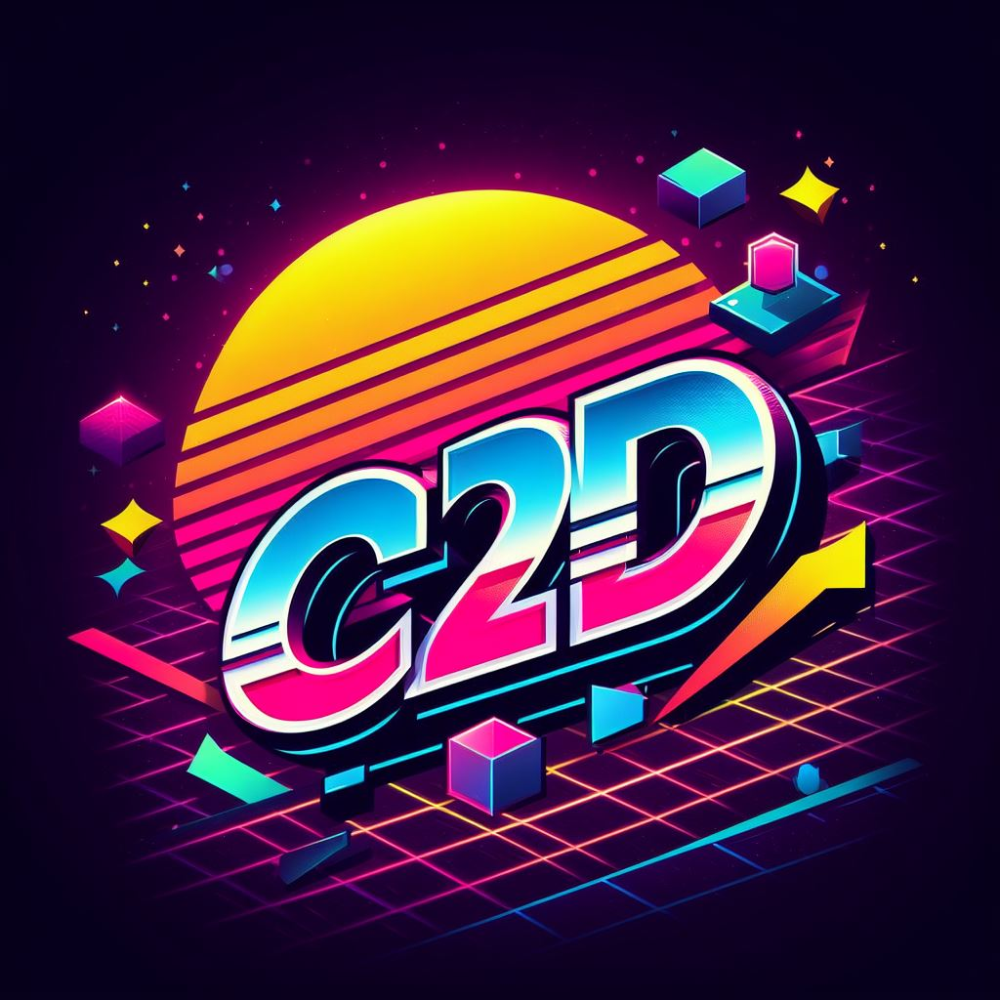

# About
Core2D is the powerhouse used by [Maragato マラガト](https://maragato.itch.io) apps, among others. It is the evolution of Videogame, which in turn was the evolution of Quick. In its current form, it adopts [JavaScript modules](https://developer.mozilla.org/en-US/docs/Web/JavaScript/Guide/Modules), leveraging the full power of [Object-oriented programming](https://developer.mozilla.org/en-US/docs/Learn/JavaScript/Objects/Object-oriented_programming).

## Concept
Apps created with Core2D are made of one or more [scenes](src/Scene.mjs), which may contain one or more [sprites](src/Sprite.mjs). These objects have properties that can be customized to shape their behavior. It's that simple.

# Get Started
[Download](https://github.com/dgchrt/core2d-skel/archive/refs/heads/main.zip) or clone/fork the [skeleton project](https://github.com/dgchrt/core2d-skel/) to start building your app. Alternatively, the library can be also installed to your existing/new project:
```shell
npm install core2d
```

## Learn
The best way to learn is by doing, and you can see what Core2D is capable of through existing open-sourced apps. Check the [Hall of Fame](#hall-of-fame) below for some source code.

## Support
Please consider joining the [Discussions](https://github.com/dgchrt/core2d/discussions) for collaboration and support.

# Features

## Scene Management
Core2D facilitates the organization of your app into one or more [scenes](src/Scene.mjs), which can be transitioned between. Each scene can contain multiple [sprites](src/Sprite.mjs), which are the basic building blocks for game objects.

## Sound Management
The engine provides a simple yet powerful sound system that allows for playing sound effects and background music. It also supports fading out the current theme, which is useful for smooth transitions between different music tracks.

## Collision Detection
Translated to callbacks, to keep update logic clean.

## Assets Caching
Assets and their transformations are reused automatically to keep a solid performance.

## Transformations
Core2D provides a set of functions to manipulate images, including rotation, flipping, and colorization. These transformations are cached, so they are only applied once per image.

## Tilemap
The `Scene` class provides a `build` method that allows for creating tile-based scenes from a map. This is useful for creating levels in platformers, RPGs, and other genres that use tile-based graphics.

## User Input
Human interaction is unified via abstractions, so that apps will just work, regardless of the devices in use.

### Controllers


Gamepads or keyboard. When using a keyboard, sensible defaults (minding accessibility) are used, as seen in [KeyMap.mjs](https://github.com/dgchrt/core2d/blob/main/src/KeyMap.mjs).

### Pointers


Mice or touch screen.

## Virtual Resolution
Internal geometry frees the app logic from displays, i.e. your app can have an internal logic resolution of 800x600, while running on any display size.

# Plugins
Core2D comes with a set of optional plugins that can be used to extend its functionality. These plugins are located in the `src/plugin` directory and can be used by importing them into your project.

- **BaseTile:** A basic tile sprite that can be used with the `Scene.build` method.
- **ClickableSprite:** A sprite that can be clicked or tapped.
- **ControllableSprite:** A sprite that can be controlled by a gamepad or keyboard.
- **CursorSprite:** A sprite that follows the pointer.
- **Fog:** A simple fog effect.
- **FontSprite:** A sprite that displays text using a custom font.
- **JumperSprite:** A sprite that can jump.
- **RandomRectTransition:** A transition that fills the screen with random rectangles.
- **Starfield:** A simple starfield effect.

# Contributing
The core of the library (under `src/`) should remain agnostic and lean. Updates to the core library are usually related to technology developments in the platform (web API advances), while staying true to the basic concepts of the library, which are common to all apps.

Opinionated functionality should be implemented in the form of a plugin (under `src/plugin/`). Plugins can add features that are domain driven, such as elements that can be reused by multiple apps, but not necessarily by every app.

# Hall of Fame
Apps created with Core2D:
- [Asteroids Remake](https://chamun.github.io/asteroids-remake/) ([source](https://github.com/chamun/asteroids-remake))
- [Cityscape](https://puter.com/app/cityscape) - Single-player arcade survival game
- [Cucurbita's Halloween](https://www.kongregate.com/games/bbastudios/cucurbitas-halloween)
- [Dragonfire](http://staudt.github.io/dragonfire) ([source](https://github.com/staudt/dragonfire))
- [Missile Commander](https://dgchrt.github.io/missile-commander/) ([source](https://github.com/dgchrt/missile-commander))
- [Ms. Starship](https://puter.com/app/ms-starship) - Multi-player arcade shoot'em up
- [Mythology](https://puter.com/app/mythology) - Single-player arcade pinball
- [Raycaster](https://staudt.github.io/raycaster/) ([source](https://github.com/staudt/raycaster))
- [Starship](https://puter.com/app/starship) - Single-player arcade shoot'em up
- [Super Breakout Bros.](https://staudt.github.io/SuperBreakoutBros/) ([source](https://github.com/staudt/SuperBreakoutBros))
- [Tower Defense](https://danielcolnaghi.github.io/towerdefense) ([source](https://github.com/danielcolnaghi/towerdefense))
